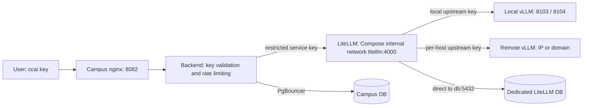

# AI API User and Deployment Manual

> **English** | [繁體中文](./ai-api-user-manual.zh-TW.md)

This manual covers the deployment in which the main Campus Compose stack integrates LiteLLM.
Regular users obtain `ccai_*` keys from Campus; operators manage Docker from the project root,
and model connections are centralised in `vllm-service/models.json`. Unless stated otherwise,
every deployment command below is run from `Campus-Cloud/`.

## 1. Request flow and file locations



LiteLLM shares the Compose `skylab` internal network with the backend and worker; the backend calls it at
`http://litellm:4000`. LiteLLM connects directly to its own dedicated database on the same PostgreSQL
instance (`db:5432`), bypassing PgBouncer. On the host, only `127.0.0.1:4000` is exposed, for health
checks, key issuance and admin tooling. LiteLLM is not behind nginx: users always go through Campus
`/api/v1/ai-proxy`, where the backend validates the `ccai_*` key and applies rate limiting before
forwarding. LiteLLM's admin UI, `/key/*` and health APIs are not exposed publicly; when you need the
admin UI, connect to `127.0.0.1:4000` from the deployment host itself or through an SSH tunnel.

| File | Purpose | Day-to-day maintenance |
| --- | --- | --- |
| `docker-compose.yml` | Campus production Docker entry point; includes the original LiteLLM Compose | `docker compose` from the repo root |
| `vllm-service/litellm/docker-compose.yml` | LiteLLM service definition; also kept as the standalone entry point | Edit once, shared by both launch modes |
| `.env` | URLs and the restricted service key used by Campus backend/worker to reach LiteLLM | Keep existing values; never store LiteLLM admin/upstream keys here |
| `vllm-service/litellm/.env` | LiteLLM master key, salt, DB and every upstream key | Injected only into the LiteLLM container |
| `vllm-service/models.json` | List of local and remote model connections | Add/remove models, adjust aliases or IPs |
| `vllm-service/litellm/config.template.yaml` | Shared timeout, retry and health-check policy | Edit only when the policy changes |
| `vllm-service/litellm/config.yaml` | LiteLLM routing generated from the list and the template | Keep in place; never edit directly |
| `scripts/prepare-ai-stack.sh` | `--init-env` fills in keys; pre-flight checks and production config generation; `--start` creates the DB, issues/syncs the service key and starts everything | Run before deploying or changing routes |

`config.yaml`, `models.json` and the real `.env` files are all ignored by Git. Examples and templates may be committed.
The root `.dockerignore` excludes the inference directories and every layer's `.env` so that model weights
and secrets never end up in the Campus build. The LiteLLM `.env` is deliberately not merged into the main
`.env`: backend, worker and prestart read the main `.env`, and keeping them separate ensures that
high-privilege keys only reach the gateway. Maintenance stays small thanks to a single Compose definition,
one model list and the pre-flight checks.

## 2. Filling in addresses and keys

The AI section of the main `.env`:

```dotenv
AI_API_BASE_URL=http://litellm:4000
AI_API_API_KEY=<restricted service key starting with sk-; generated automatically by --init-env>
LITELLM_RUNTIME_BASE_URL=http://litellm:4000
LITELLM_RUNTIME_API_KEY=<the same restricted service key; filled in automatically by --init-env>
# If this field already exists it must match AI_API_API_KEY; it can be omitted otherwise.
LITELLM_SERVICE_API_KEY=<the same restricted service key>
AI_API_PUBLIC_BASE_URL=https://campus.example.edu
BACKEND_HOST_PORT=8000
REDIS_HOST_PORT=6379
```

`AI_API_PUBLIC_BASE_URL` is the Campus root URL that users can reach; locally it defaults to
`http://localhost:8082`. The full API base URL is that address plus `/api/v1/ai-proxy`.
If the backend runs directly on the host, change both gateway URLs to `http://127.0.0.1:4000`;
in main-Compose mode always use the service name `litellm` (the pre-flight check rejects `127.0.0.1`
and the old `host.docker.internal`).

`AI_API_API_KEY` is chosen by the deployment and registered in LiteLLM: `--start` uses the master key to
create a Virtual Key in LiteLLM with this value (alias `campus-ai-api-service`); if it already exists, the
model allowlist is synced to the aliases currently in `models.json`. When reusing an existing LiteLLM
database, simply fill in the key that was originally issued to Campus.

The LiteLLM `.env`:

```dotenv
LITELLM_MASTER_KEY=<gateway admin key; generated automatically by --init-env>
VLLM_UPSTREAM_API_KEY=<API_KEY of the vLLM on the inference host; same as .env.API for local models>
DATABASE_URL=postgresql://litellm:<URL-encoded password>@db:5432/litellm
LITELLM_SALT_KEY=<random key created on first deployment and kept fixed afterwards; generated automatically by --init-env>
# Only needed by remote models that use api_key_env; not needed when using apikeys.
REMOTE_LAB_API_KEY=<API_KEY of the remote vLLM>
# Optional: host-side port (bound to 127.0.0.1 only) for health checks and admin tooling.
# LITELLM_HOST_PORT=4000
# Optional: a verified tag or digest for reproducible upgrades/rollbacks.
# LITELLM_IMAGE=litellm/litellm:<tested-tag>
```

`--init-env` only fills in entries that are missing or still hold example values (`replace-with-*`,
`ai-api-secret-*`); existing real values are never touched, so it is safe to run repeatedly. Upstream vLLM
keys cannot be generated: for local models they are copied from `.env.API`, and keys for remote hosts must
be entered by hand.

| Key | User / service | Scope |
| --- | --- | --- |
| `ccai_*` | Regular user → Campus | Personal API access approved by Campus |
| `AI_API_API_KEY` | Campus → LiteLLM | Models allowed by the LiteLLM Virtual Key |
| `LITELLM_MASTER_KEY` | Operators → LiteLLM | Gateway administration and Virtual Key issuance |
| `VLLM_UPSTREAM_API_KEY`, remote keys | LiteLLM → inference hosts | Each upstream's model API |

Never substitute one class of key for another. Regular users receive a `ccai_*` key and do not need to
know inference host IPs or service keys. When `LITELLM_RUNTIME_API_KEY` is not set, the admin-side runtime
observability features stay disabled.

### DATABASE_URL and LITELLM_SALT_KEY

`DATABASE_URL` is a database connection string, not the stored records themselves. LiteLLM uses it to
persist Virtual Key configuration and validation data, usage and spend records, user/team settings and its
own schema. Whether usage records include request content depends on LiteLLM's logging settings; do not
assume it stores only token counts. The database must be a dedicated DB with its own login role. It must
not point to the Campus application DB, and Campus Alembic must never be run against it.

`LITELLM_SALT_KEY` is used by LiteLLM to encrypt and decrypt some sensitive settings and upstream
credentials it stores; it is not a user API key. Keep it fixed, and back it up and restore it together
with the DB; replacing it makes the existing encrypted data undecryptable. It does not automatically
encrypt all logs. See the [LiteLLM encryption FAQ](https://docs.litellm.ai/docs/proxy/security_encryption_faq).

In a same-host deployment, LiteLLM and the main Compose PostgreSQL are on the same internal network, so the
host in the URL is `db:5432`, unrelated to `POSTGRES_HOST_PORT`. Do not use `pgbouncer` (LiteLLM's Prisma
needs session semantics) or `127.0.0.1` (inside the container that points to itself). When the host is
`db`, `--start` automatically creates the dedicated role and database using the account, password and
database name in the URL (if they already exist, the role password is aligned with the URL), and verifies
that the role has no table-creation privilege on the Campus database; LiteLLM runs its own schema
migration on startup. For a remote DB, enter that host's IP/domain and connection parameters and keep the
existing DB and salt; external DBs are created by their own administrators and the script will not touch
them. The integrated Compose does not migrate databases automatically. The old host-network value
`127.0.0.1:5433` is rewritten to `db:5432` by `--init-env`.

## 3. Local and remote model list

The current local models are `gpt-oss-20B` (8103) and `NVIDIA-Nemotron-Nano-9B-v2-FP8` (8104);
the actual public names are whatever `models.json` and the `/models` response say. The following are
field examples; merge them into the existing JSON array and keep the existing models' GPU, context,
parser and other tuning parameters.

Local entries default to `deployment` = `local`:

```json
{
  "alias": "gpt-oss-20B",
  "deployment": "local",
  "served_model_name": "gpt-oss-20B",
  "model_name": "./AImodels/gpt-oss-20B",
  "api_port": 8103,
  "gpu_memory_utilization": 0.4,
  "litellm": {"rpm": 10},
  "capabilities": {"chat": true}
}
```

Remote vLLM entries need no `model_name`, `api_port` or local GPU configuration:

```json
{
  "alias": "remote-lab-chat",
  "deployment": "remote",
  "served_model_name": "lab-chat-model",
  "api_base": "http://192.0.2.20:8103/v1",
  "api_key_env": "REMOTE_LAB_API_KEY",
  "litellm": {"rpm": 10},
  "capabilities": {"chat": true}
}
```

To let a remote model carry its own key directly, use a literal `apikeys` instead:

```json
{
  "alias": "remote-lab-private",
  "deployment": "remote",
  "served_model_name": "lab-private-model",
  "api_base": "http://192.0.2.21:8103/v1",
  "apikeys": "<API key of that remote model>",
  "litellm": {"rpm": 10},
  "capabilities": {"chat": true}
}
```

`192.0.2.20` is a documentation example address and must be replaced with the real host. The remote host
should start the model first, listen on an interface the gateway can reach, and allow connections from the
gateway's source address; confirm that its `/v1/models` really serves `lab-chat-model`. When neither
`apikeys` nor `api_key_env` is given, `VLLM_UPSTREAM_API_KEY` is used; with `api_key_env` the key is read
from the LiteLLM `.env`, and with `apikeys` it is written straight into the generated
`litellm/config.yaml`. `apikeys` and `api_key_env` cannot be set at the same time. Because `apikeys` is
plaintext, neither `models.json` nor the generated `config.yaml` may be committed or copied to an
untrusted location.

`alias` is the name callers put in the `model` field and must be unique across all entries; local
`served_model_name` and `api_port` must be unique as well. Different remote hosts may use the same upstream
model name/port, but their public aliases must differ. `api_base` must include `/v1`, and credentials must
not be embedded in the URL. The current generator uses the `hosted_vllm` provider and this example targets
remote vLLM; cloud-native providers or other protocols require extending the generator, and entering an IP
does not convert the protocol automatically. `capabilities` is descriptive metadata: tools, reasoning or
multimodal features only work if the model and the vLLM parser actually support them.

The local launcher skips `remote` entries and does not consume local GPU. A fully remote deployment does
not need to run the cluster launcher. Routing for both local and remote models is handled by LiteLLM.

## 4. Production launch and taking over an existing standalone gateway

Requires Linux Docker Engine, Docker Compose 2.20 or later, and a Python with `PyYAML` and
`python-dotenv`. The script prefers `vllm-service/.venv/bin/python`; you can also point it at an
interpreter with `AI_STACK_PYTHON=/path/to/python`.
Relative mount paths in Compose resolve against the directory of the included file; see the
[Docker include reference](https://docs.docker.com/reference/compose-file/include/).

### Three-step deployment (same for fresh and existing deployments)

```bash
# 1. Fill in keys and addresses: only missing or example values are written, real values are left alone (safe to repeat)
bash scripts/prepare-ai-stack.sh --init-env
# 2. Enter the upstream keys that --init-env prompts for (e.g. the DGX VLLM_UPSTREAM_API_KEY) and prepare models.json
# 3. Pre-flight checks, config generation, DB creation, LiteLLM start, service key issuance/sync, then start the main Compose
bash scripts/prepare-ai-stack.sh --start
```

The main `.env` must first be created from `.env.example` with the required Campus parameters filled in;
if the LiteLLM `.env` does not exist, `--init-env` creates it from the template. `--init-env` generates
automatically:

- the LiteLLM `LITELLM_MASTER_KEY` (starting with `sk-`) and `LITELLM_SALT_KEY`;
- `DATABASE_URL` (`litellm` account, random password, `db:5432/litellm`);
- `AI_API_API_KEY` and `LITELLM_RUNTIME_API_KEY` in the main `.env` (the same `sk-` key),
  and sets both gateway URLs to `http://litellm:4000`.

`--start` runs, in order:

1. Verifies root/gateway key isolation, service key consistency, local upstream key consistency with
   `.env.API`, DB name/account isolation and required remote keys (upstreams are not queried; run
   `--check-only --check-upstreams` separately when needed);
2. Generates the production `config.yaml`;
3. When the `DATABASE_URL` host is `db`, starts the main Compose PostgreSQL, waits for it to accept TCP
   connections, then creates the dedicated role and database (or aligns the password);
4. Recreates LiteLLM to load the new routes and waits for `/health/readiness` to report the database as
   connected (the first run performs the migration first);
5. Registers `AI_API_API_KEY` in LiteLLM using the master key (alias `campus-ai-api-service`); if it
   already exists, syncs its model allowlist to the aliases currently in `models.json`;
6. Starts the main project with `docker compose up -d --build`.

It does not stop gateways belonging to other projects: if a standalone `campus-litellm` is running, the
script aborts the start and leaves the existing service alone. Stop it first, then rerun:

```bash
docker compose -f vllm-service/litellm/docker-compose.yml \
  --env-file vllm-service/litellm/.env stop litellm
bash scripts/prepare-ai-stack.sh --start
docker compose ps
curl -fsS http://127.0.0.1:4000/health/readiness
```

Verify only, without changing any file:

```bash
bash scripts/prepare-ai-stack.sh --check-only --check-upstreams
```

If the local models are not running yet, run `bash vllm-service/start_multi_model_cluster.sh` first;
skip this for fully remote deployments. LiteLLM runs inside a container, so local vLLM must listen on an
interface Docker can reach: set `API_HOST=0.0.0.0` in `.env.API` and use the firewall to restrict
8103/8104 to the host and the Docker network. The pre-flight check rejects configurations bound only to
loopback.

### Reusing an existing LiteLLM database

Keep the original `LITELLM_MASTER_KEY`, `LITELLM_SALT_KEY` and `DATABASE_URL` (for an external host enter
its IP/domain; the script will not try to create it), and put the service key originally issued to
Campus into `AI_API_API_KEY` and `LITELLM_RUNTIME_API_KEY` in the main `.env`. `--init-env` leaves real
values untouched; `--start` only syncs that key's model allowlist.

### Upgrading from the old host-network deployment

The old settings `AI_API_BASE_URL=http://host.docker.internal:4000` and
`DATABASE_URL=...@127.0.0.1:5433/...` are unreachable under the internal-network architecture. Run
`--init-env` once: it rewrites the gateway URL to `http://litellm:4000` and the database host to
`db:5432` (account and password unchanged), then run `--start`.

### Manual deployment workflow

The runner must have `/opt/skylab/.env` and `/opt/skylab/vllm-service/models.json` prepared in advance;
with local models it also needs `/opt/skylab/vllm-service/.env.API`. The workflow first runs `--init-env`
against `/opt/skylab` (a missing LiteLLM `.env` is created from the template; keys are written back to
`/opt/skylab` so they persist across deployments, and nothing is written when nothing is missing) and
fails at this step if upstream keys are still missing. It then copies the files into the checkout, and
`--start` completes DB creation, key issuance and startup. The runner must be able to use
`python3 -m venv` and have write access to `/opt/skylab` (when keys are filled in for the first time).
GPU model processes should be managed independently on the deployment host, not inside the runner's
working directory, which may be wiped by a checkout.

## 5. Changing connections, restarting and rolling back

To add a model or change an IP: edit `models.json`, add the matching key to the LiteLLM `.env`, then run:

```bash
bash scripts/prepare-ai-stack.sh --start
```

`--start` recreates LiteLLM to load the new routes and syncs the Campus service Virtual Key's model
allowlist to the new alias list; no separate `/key/update` call is needed. If you only recreate with
`docker compose up -d --force-recreate litellm`, the allowlist is not synced and new models remain
unavailable to Campus users. Changing the model itself, the GPU or the local listening port also requires
restarting the local inference cluster. After editing the main `.env`, run
`docker compose up -d --force-recreate backend worker` so the containers pick up the new values. A plain
`restart` does not re-inject `.env`.

| Operation | Root-directory command / effect |
| --- | --- |
| Check status | `docker compose ps` |
| Gateway logs | `docker compose logs --tail 100 -f litellm` |
| Stop only the gateway | `docker compose stop litellm` |
| Recreate the gateway | `docker compose up -d --force-recreate litellm` |
| Stop the main Docker stack | `docker compose down`, including the taken-over LiteLLM |

**Monitoring**: "Resource Monitoring → System Health" lists the status of the AI Gateway (LiteLLM) and of
every model; when a model's upstream inference service (for example the DGX) is unreachable, a system
alert is raised and emailed to administrators. With the monitoring stack enabled, the Grafana "SkyLab AI"
dashboard shows Campus request volume/errors/latency plus LiteLLM and vLLM engine metrics; the vLLM scrape
targets are generated automatically by `--start` from `models.json`, and the remote host's firewall must
allow the deployment host to reach the inference port (the same rule LiteLLM needs). See
[System Monitoring](monitoring.md#ai-module-monitoring) for details.

`down` does not stop host vLLM processes and does not delete an external LiteLLM DB. Do not use `down -v`
as the routine stop command. When the config is missing, the Compose bind mount fails outright instead of
accidentally creating a `config.yaml/` directory.

Falling back to standalone deployment: first run `docker compose stop litellm` at the root, then run
`docker compose up -d` from `vllm-service/litellm/`. Use the same DB URL, salt and config.
LiteLLM is the only AI API gateway; the early hand-written FastAPI Gateway has been removed and there is
no other fallback entry point.

## 6. Requesting and calling the API as a regular user

Sign in to Campus, open the AI API page, fill in the purpose, key name and duration, and submit the
request. Once someone with approval rights approves it, the user can view their key and connection
examples. The key list only returns prefixes; the single plaintext key is shown only to its owner.
Students can choose 1, 7, 30 or 90 days (default 30); teachers and administrators can choose 1, 7 or 30
days or permanent (default permanent). Students must explicitly provide `duration` when requesting via
the API; the validity period starts at approval. No role may request a 1-hour key. Old pending 1-hour
requests and pending permanent requests from students must be rejected and resubmitted; already issued
keys keep their original expiry. After rotation the old key is invalidated immediately, so programs using
it must be updated at the same time; users can view their own usage and revoke keys they no longer use.

The request-management endpoints under `/api/v1/ai-api/*` use the Campus login bearer token; the
inference endpoints below use `ccai_*`. These are two different kinds of authentication. Set the
`base_url` of your SDK or compatible client to `https://campus.example.edu/api/v1/ai-proxy`, without an
extra `/v1` segment.

| Method / endpoint (relative to the base URL) | Purpose |
| --- | --- |
| `GET /models` | List the model IDs available to the current service key |
| `POST /chat/completions` | Chat with messages; SSE streaming available |
| `POST /completions` | Prompt-based text generation; requires upstream support |
| `POST /responses` | Responses format; requires upstream support |

Campus does not forward LiteLLM's admin, key, DB or health APIs. Other endpoints such as embeddings are
currently outside the public scope of the Campus proxy.

### curl: model list and chat

```bash
export CAMPUS_AI_BASE_URL='http://localhost:8082/api/v1/ai-proxy'
read -rsp 'Campus ccai key: ' CAMPUS_AI_API_KEY; echo
export CAMPUS_AI_API_KEY
curl --fail --silent --show-error \
  --config <(printf 'header = "Authorization: Bearer %s"\n' "$CAMPUS_AI_API_KEY") \
  "$CAMPUS_AI_BASE_URL/models"

curl --fail --silent --show-error \
  --config <(printf 'header = "Authorization: Bearer %s"\n' "$CAMPUS_AI_API_KEY") \
  -H 'Content-Type: application/json' \
  --data '{"model":"gpt-oss-20B","messages":[{"role":"user","content":"請用繁體中文簡述你的功能。"}],"max_tokens":512}' \
  "$CAMPUS_AI_BASE_URL/chat/completions"
```

Replace `model` with an ID returned by `/models` to switch models. For streaming, add `"stream":true`
and pass `--no-buffer` to curl to receive `data:` events line by line. Reasoning models may spend
reasoning tokens first; if `content` comes back empty with `finish_reason=length`, increase the token
budget and check the model parser first rather than concluding that the connection is broken.

Python can call the API over plain HTTP without any particular SDK:

```python
import json
import os
from urllib.request import Request, urlopen

base = os.environ["CAMPUS_AI_BASE_URL"].rstrip("/")
request = Request(
    base + "/chat/completions",
    data=json.dumps({
        "model": "gpt-oss-20B",
        "messages": [{"role": "user", "content": "你好"}],
        "max_tokens": 512,
    }).encode(),
    headers={
        "Authorization": "Bearer " + os.environ["CAMPUS_AI_API_KEY"],
        "Content-Type": "application/json",
    },
)
with urlopen(request, timeout=120) as response:
    payload = json.load(response)
print(payload["choices"][0]["message"])
```

### Operational verification

```bash
bash scripts/prepare-ai-stack.sh --check-only --check-upstreams
curl -fsS http://127.0.0.1:4000/health/liveliness
curl -fsS http://127.0.0.1:4000/health/readiness
# With the Campus backend running, use the admin key to verify the gateway model list, upstreams and backend connectivity.
read -rsp 'LiteLLM master key: ' LITELLM_MASTER_KEY; echo
export LITELLM_MASTER_KEY
bash scripts/verify-litellm-staging.sh
unset LITELLM_MASTER_KEY

# Verify the four public endpoints with an approved Campus test key.
export AI_API_SMOKE_KEY="$CAMPUS_AI_API_KEY"
AI_API_PUBLIC_BASE_URL=http://localhost:8082/api/v1 \
  AI_API_SMOKE_MODEL=gpt-oss-20B bash scripts/verify-ai-api-cutover.sh
unset AI_API_SMOKE_KEY
```

`verify-ai-api-cutover.sh` sends real generation and streaming requests and therefore consumes model
usage; use a dedicated test key. The script needs curl and jq, and the test model must support
completions and responses. Passing everything means those paths work; it does not mean other models
support every format. Run `unset CAMPUS_AI_API_KEY` when you are done.

## 7. Troubleshooting

| Symptom | What to check / do |
| --- | --- |
| `4000` already in use / two gateways | Check the Compose project with `docker ps`; stop the old gateway before taking over, or set `LITELLM_HOST_PORT` |
| Backend cannot reach the gateway | `AI_API_BASE_URL` should be `http://litellm:4000` (the old `host.docker.internal` no longer applies; run `--init-env` to rewrite it) |
| Local upstream returns 401 | `API_KEY` in `.env.API` must match the LiteLLM upstream key |
| Local upstream unreachable | `API_HOST` in `.env.API` must be `0.0.0.0` (the container connects via `host.docker.internal`), and restrict the engine port with the firewall |
| Remote model connection fails | Check IP/domain, listening interface, firewall, `/v1`, served model name and key consistency |
| Campus 401 / 403 | Check whether the `ccai_*` key is approved, expired or revoked; whether the service Virtual Key is valid and allows the model (`--start` re-registers and syncs it) |
| New model missing from the model list | Redeploy with `--start`: it regenerates the config, recreates LiteLLM and syncs the service key allowlist |
| `--start` stuck waiting for LiteLLM readiness | `docker compose logs litellm`; usually wrong `DATABASE_URL` credentials/host, or the first migration is still running |
| Key issuance returns HTTP 400 | Another key already uses the alias `campus-ai-api-service`: put that key into `AI_API_API_KEY`, or revoke it in LiteLLM and rerun |
| 429 | Campus rate limit or LiteLLM RPM limit; retry after the `Retry-After` delay |
| 413 / 415 | Request exceeds `AI_API_MAX_REQUEST_BODY_BYTES`, or Content-Type is not JSON |
| 502 / 503 | Check whether the gateway, upstream and DB are available, then read the backend/LiteLLM logs |
| DB authentication / migration failure | Check the dedicated role, URL-encoded password, DB host and port; do not switch to the Campus DB |
| Cannot decrypt after changing the salt | Restore the original salt and the matching DB backup; old ciphertext cannot be repaired with a new salt |
| `.env` changes have no effect | Recreate the affected containers with `up -d --force-recreate` |
| `8000` or `6379` port conflict | Set `BACKEND_HOST_PORT` / `REDIS_HOST_PORT`; service ports between containers stay unchanged |

LiteLLM only opens port `127.0.0.1:4000` on the host and is unreachable from external networks; traffic
between containers always uses the Compose internal network. The normal entry point for users is Campus
(nginx → backend); LiteLLM is not exposed through nginx. For the full LiteLLM feature set and key
management, see [Virtual Keys](https://docs.litellm.ai/docs/proxy/virtual_keys) and the
[vLLM provider](https://docs.litellm.ai/docs/providers/vllm).
