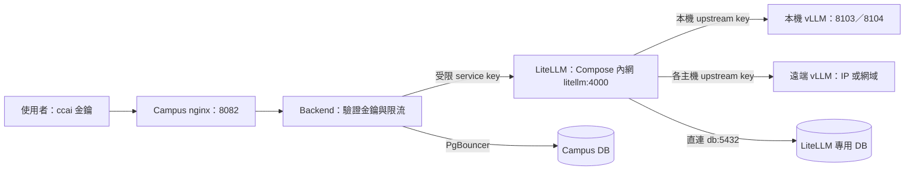

# AI API 使用與部署手冊

> [English](./ai-api-user-manual.md) | **繁體中文**

本手冊適用於 Campus 主 Compose 整合 LiteLLM 的部署方式。一般使用者從 Campus
取得 `ccai_*` 金鑰；維運人員統一在專案根目錄管理 Docker，模型連線集中在
`vllm-service/models.json`。以下部署指令除特別標示外，均在 `Campus-Cloud/` 執行。

## 1. 呼叫流程與檔案位置



LiteLLM 與 backend／worker 同在 Compose `skylab` 內網，backend 以 `http://litellm:4000` 呼叫；
LiteLLM 直連同一台 PostgreSQL 的專用資料庫（`db:5432`），不經 PgBouncer。主機上只有
`127.0.0.1:4000` 供健康檢查、金鑰核發與管理工具使用。LiteLLM 不接 nginx：使用者一律經
Campus `/api/v1/ai-proxy` 由 backend 驗證 `ccai_*` 金鑰與限流後轉送，LiteLLM 的管理 UI、
`/key/*` 與 health API 不對外公開；需要管理 UI 時從部署機本機或 SSH tunnel 連 `127.0.0.1:4000`。

| 檔案 | 用途 | 日常維護方式 |
| --- | --- | --- |
| `docker-compose.yml` | Campus 正式 Docker 入口；include 原 LiteLLM Compose | 根目錄 `docker compose` |
| `vllm-service/litellm/docker-compose.yml` | LiteLLM 服務定義；也保留獨立部署入口 | 修改一次，兩種啟動模式共用 |
| `.env` | Campus、backend/worker 到 LiteLLM 的 URL 與受限 service key | 保留現有值，不存 LiteLLM 管理／上游金鑰 |
| `vllm-service/litellm/.env` | LiteLLM master、salt、DB、各上游金鑰 | 僅注入 LiteLLM 容器 |
| `vllm-service/models.json` | 本機與遠端模型連線清單 | 新增／移除模型、調整 alias 或 IP |
| `vllm-service/litellm/config.template.yaml` | 共用 timeout、重試、健康檢查等政策 | 政策有變更才修改 |
| `vllm-service/litellm/config.yaml` | 由清單與 template 產生的 LiteLLM 路由 | 保留原位置；不要直接編輯 |
| `scripts/prepare-ai-stack.sh` | `--init-env` 補齊金鑰；預檢查、產生 production config；`--start` 自動建 DB、核發／同步 service key 並啟動 | 部署／改路由前執行 |

`config.yaml`、`models.json` 與實際 `.env` 均受 Git 忽略。範例與 template 可提交。
根目錄 `.dockerignore` 排除推論目錄與各層 `.env`，避免將模型權重／機密帶入 Campus build。
不將 LiteLLM `.env` 合併到主 `.env`：backend、worker、prestart 會讀取主 `.env`，
分開可讓高權限金鑰只進入 gateway。減少維護工作靠單一 Compose 定義、模型清單與預檢查。

## 2. 位址與金鑰怎麼填

主 `.env` 的 AI 區域：

```dotenv
AI_API_BASE_URL=http://litellm:4000
AI_API_API_KEY=<sk- 開頭的受限 service key；--init-env 自動產生>
LITELLM_RUNTIME_BASE_URL=http://litellm:4000
LITELLM_RUNTIME_API_KEY=<同一把受限 service key；--init-env 自動填入>
# 若原本已有這個欄位，須與 AI_API_API_KEY 一致；沒有可省略。
LITELLM_SERVICE_API_KEY=<同一把受限 service key>
AI_API_PUBLIC_BASE_URL=https://campus.example.edu
BACKEND_HOST_PORT=8000
REDIS_HOST_PORT=6379
```

`AI_API_PUBLIC_BASE_URL` 是使用者可以連線的 Campus 根網址；本機預設為
`http://localhost:8082`。API 完整 base URL 為該網址加上 `/api/v1/ai-proxy`。
如果 backend 直接跑在主機上，兩個 gateway URL 改用 `http://127.0.0.1:4000`；
主 Compose 模式一律用服務名稱 `litellm`（預檢查會擋 `127.0.0.1` 與舊的 `host.docker.internal`）。

`AI_API_API_KEY` 由部署端決定、LiteLLM 依它登記：`--start` 會用 master key 在 LiteLLM
以這個值建立 Virtual Key（別名 `campus-ai-api-service`），已存在時則把模型白名單同步成
`models.json` 目前的 alias。沿用既有 LiteLLM 資料庫時，把當初核發給 Campus 的那把 key 填進來即可。

LiteLLM `.env`：

```dotenv
LITELLM_MASTER_KEY=<gateway 管理金鑰；--init-env 自動產生>
VLLM_UPSTREAM_API_KEY=<推論主機 vLLM 的 API_KEY；本機模型與 .env.API 相同>
DATABASE_URL=postgresql://litellm:<已 URL 編碼的密碼>@db:5432/litellm
LITELLM_SALT_KEY=<第一次部署建立、後續固定保留的隨機金鑰；--init-env 自動產生>
# 使用 api_key_env 的遠端模型才需要；使用 apikeys 時不需要此變數。
REMOTE_LAB_API_KEY=<遠端 vLLM 的 API_KEY>
# 可選：主機端埠（只綁 127.0.0.1），供健康檢查與管理工具。
# LITELLM_HOST_PORT=4000
# 可選：填已驗證的 tag 或 digest，供可重現的升級／回滾。
# LITELLM_IMAGE=litellm/litellm:<tested-tag>
```

`--init-env` 只補缺少或仍為範例值（`replace-with-*`、`ai-api-secret-*`）的項目，既有真實值一律不動，
所以可以重複執行。上游 vLLM 金鑰無法產生，本機模型會從 `.env.API` 複製，遠端主機的 key 需手動填入。

| 金鑰 | 使用者／服務 | 授權範圍 |
| --- | --- | --- |
| `ccai_*` | 一般使用者 → Campus | Campus 核准的個人 API 存取 |
| `AI_API_API_KEY` | Campus → LiteLLM | LiteLLM Virtual Key 允許的模型 |
| `LITELLM_MASTER_KEY` | 維運人員 → LiteLLM | gateway 管理與 Virtual Key 核發 |
| `VLLM_UPSTREAM_API_KEY`、遠端 key | LiteLLM → 推論主機 | 各上游的模型 API |

不要互相替代這幾類金鑰。一般使用者取得的是 `ccai_*`，不需知道推論主機 IP 或服務金鑰。
`LITELLM_RUNTIME_API_KEY` 未設定時，管理端 runtime 觀測功能維持關閉。

### DATABASE_URL 與 LITELLM_SALT_KEY

`DATABASE_URL` 是資料庫連線字串，不是紀錄內容本身。LiteLLM 透過它保存 Virtual Key
設定／驗證資料、用量與花費紀錄、使用者／團隊設定，以及自己的 schema。用量紀錄
是否包含請求內容取決於 LiteLLM 記錄設定；不要假設它只保存 token 數。
資料庫須使用獨立 DB 與登入帳號，不可指向 Campus 的應用程式 DB，也不可對它執行 Campus Alembic。

`LITELLM_SALT_KEY` 用於 LiteLLM 保存部分敏感設定／上游憑證時的加解密，不是使用者 API key。
固定保留，與 DB 一起備份、一起還原；直接換掉會使既有加密資料無法解密。
它不會將所有日誌自動加密。詳見 [LiteLLM 加密說明](https://docs.litellm.ai/docs/proxy/security_encryption_faq)。

同機部署時 LiteLLM 與主 Compose PostgreSQL 在同一內網，URL 主機填 `db:5432`，與 `POSTGRES_HOST_PORT`
無關；不可填 `pgbouncer`（LiteLLM 的 Prisma 需要 session 語意），也不可填 `127.0.0.1`（容器內指向自己）。
主機為 `db` 時，`--start` 會以 URL 內的帳號、密碼、資料庫名稱自動建立專用角色與資料庫（已存在則把角色
密碼對齊 URL），並驗證該角色對 Campus 資料庫沒有建表權限；LiteLLM 啟動時自行跑 schema migration。
使用遠端 DB 時填該主機的 IP／網域及連線參數，保留既有 DB 與 salt 即可；外部 DB 由其管理者建立，腳本不會碰。
整合 Compose 不會自動搬移資料庫。舊版 host network 設定的 `127.0.0.1:5433` 會由 `--init-env` 改寫為 `db:5432`。

## 3. 本機與遠端模型清單

範例設定（`vllm-service/models.json.example`）定義兩個本機模型 `gemma-4-31b`（8103）與
`qwen3-14b`（8104）；本手冊出現的模型名稱都是範例，實際對外名稱以 `models.json` 與
`/models` 回應為準。以下為欄位範例，請合併到現有
JSON 陣列，保留原有模型的 GPU、context、parser 等調校參數。

本機項目預設 `deployment` 為 `local`：

```json
{
  "alias": "gpt-oss-20B",
  "deployment": "local",
  "served_model_name": "gpt-oss-20B",
  "model_name": "./AImodels/gpt-oss-20B",
  "api_port": 8103,
  "gpu_memory_utilization": 0.4,
  "litellm": {"rpm": 10},
  "capabilities": {"chat": true}
}
```

遠端 vLLM 項目不需要 `model_name`、`api_port` 或本機 GPU 配置：

```json
{
  "alias": "remote-lab-chat",
  "deployment": "remote",
  "served_model_name": "lab-chat-model",
  "api_base": "http://192.0.2.20:8103/v1",
  "api_key_env": "REMOTE_LAB_API_KEY",
  "litellm": {"rpm": 10},
  "capabilities": {"chat": true}
}
```

若要讓某個遠端模型直接保存自己的 key，可改用 literal `apikeys`：

```json
{
  "alias": "remote-lab-private",
  "deployment": "remote",
  "served_model_name": "lab-private-model",
  "api_base": "http://192.0.2.21:8103/v1",
  "apikeys": "<該遠端模型的 API key>",
  "litellm": {"rpm": 10},
  "capabilities": {"chat": true}
}
```

`192.0.2.20` 是文件示例位址，須換成實際主機。遠端主機應先啟動模型，監聽 gateway
可達的介面，並允許 gateway 的來源連線；確認它的 `/v1/models` 確實提供
`lab-chat-model`。未指定 `apikeys` 或 `api_key_env` 時沿用 `VLLM_UPSTREAM_API_KEY`；
指定 `api_key_env` 時從 LiteLLM `.env` 讀取，指定 `apikeys` 時則直接寫入生成的
`litellm/config.yaml`。`apikeys` 與 `api_key_env` 不可同時設定。因 `apikeys` 是明文，
`models.json` 與生成後的 `config.yaml` 都不可提交或複製到不受信任的位置。

`alias` 是呼叫端 `model` 欄位使用的名稱，所有項目都必須唯一；本機
`served_model_name`、`api_port` 也要唯一。不同遠端主機可使用相同上游模型名稱／埠，
但公開 alias 要不同。`api_base` 須含 `/v1`，不可把帳密寫入 URL。
目前產生器使用 `hosted_vllm` provider，這個範例針對遠端 vLLM；雲端原生 provider
或不同協定需另外擴充產生器，填 IP 不會自動轉換協定。
`capabilities` 是描述資料，仍需模型及 vLLM parser 實際支援才能啟用工具、推理或多模態功能。

本機 launcher 會略過 `remote`，不消耗本機 GPU。全遠端部署不需跑 cluster launcher。
本機與遠端模型的路由都由 LiteLLM 管理。

## 4. 正式啟動與既有獨立 gateway 接管

需要 Linux Docker Engine、Docker Compose 2.20 以上，以及包含 `PyYAML`、
`python-dotenv` 的 Python。腳本優先使用 `vllm-service/.venv/bin/python`，
也可用 `AI_STACK_PYTHON=/path/to/python` 指定。
Compose 的相對掛載路徑以被 include 的檔案目錄解析，詳見
[Docker include 說明](https://docs.docker.com/reference/compose-file/include/)。

### 部署三步驟（全新或既有部署共用）

```bash
# 1. 補齊金鑰與位址：缺少或仍為範例值才寫入，既有真實值不動（可重複執行）
bash scripts/prepare-ai-stack.sh --init-env
# 2. 填入 --init-env 提示的上游金鑰（例如 DGX 的 VLLM_UPSTREAM_API_KEY），並備妥 models.json
# 3. 預檢查、產生 config、建 DB、啟動 LiteLLM、核發／同步 service key，最後啟動主 Compose
bash scripts/prepare-ai-stack.sh --start
```

主 `.env` 需先由 `.env.example` 建立並填好 Campus 必要參數；LiteLLM `.env` 不存在時
`--init-env` 會由範本建立。`--init-env` 會自動產生：

- LiteLLM `LITELLM_MASTER_KEY`（`sk-` 開頭）、`LITELLM_SALT_KEY`；
- `DATABASE_URL`（`litellm` 帳號、隨機密碼、`db:5432/litellm`）；
- 主 `.env` 的 `AI_API_API_KEY` 與 `LITELLM_RUNTIME_API_KEY`（同一把 `sk-` key），
  並把兩個 gateway URL 設為 `http://litellm:4000`。

`--start` 依序執行：

1. 核對 root／gateway 金鑰隔離、service key 一致性、local upstream key 與 `.env.API`
   一致性、DB 名稱／帳號隔離、必要遠端 key（不查詢上游；需要時另跑 `--check-only --check-upstreams`）；
2. 產生 production `config.yaml`；
3. `DATABASE_URL` 主機為 `db` 時，啟動主 Compose PostgreSQL，等它接受 TCP 連線後
   建立（或對齊密碼）專用角色與資料庫；
4. 重建 LiteLLM 以載入新路由，等 `/health/readiness` 回報資料庫已連線（首次會先跑 migration）；
5. 以 master key 在 LiteLLM 登記 `AI_API_API_KEY`（別名 `campus-ai-api-service`），
   已存在則把模型白名單同步成 `models.json` 目前的 alias；
6. `docker compose up -d --build` 啟動主專案。

它不會自動停止其他專案的 gateway；若另有獨立 `campus-litellm` 在跑，腳本會取消啟動並保留既有服務，
先停它再重跑：

```bash
docker compose -f vllm-service/litellm/docker-compose.yml \
  --env-file vllm-service/litellm/.env stop litellm
bash scripts/prepare-ai-stack.sh --start
docker compose ps
curl -fsS http://127.0.0.1:4000/health/readiness
```

只驗證、不改檔：

```bash
bash scripts/prepare-ai-stack.sh --check-only --check-upstreams
```

本機模型若尚未執行，先 `bash vllm-service/start_multi_model_cluster.sh`；全遠端部署略過。
LiteLLM 在容器內，本機 vLLM 須監聽 Docker 可達的介面：`.env.API` 設 `API_HOST=0.0.0.0`，
並以防火牆限制 8103／8104 只供本機與 Docker 網段，預檢查會擋只綁 loopback 的設定。

### 沿用既有 LiteLLM 資料庫

保留原本的 `LITELLM_MASTER_KEY`、`LITELLM_SALT_KEY` 與 `DATABASE_URL`（外部主機填其 IP／網域，
腳本不會嘗試建立），並把當初核發給 Campus 的 service key 填入主 `.env` 的 `AI_API_API_KEY`、
`LITELLM_RUNTIME_API_KEY`。`--init-env` 看到真實值就不會改動；`--start` 只同步該 key 的模型白名單。

### 從舊版 host network 部署升級

舊設定的 `AI_API_BASE_URL=http://host.docker.internal:4000` 與
`DATABASE_URL=...@127.0.0.1:5433/...` 在內網架構下連不到。執行一次 `--init-env`，它會把 gateway URL
改成 `http://litellm:4000`、把資料庫主機改成 `db:5432`（帳號密碼不變），再 `--start`。

### 手動部署 workflow

runner 需預先配置 `/opt/skylab/.env` 與 `/opt/skylab/vllm-service/models.json`；有本機模型時還需要
`/opt/skylab/vllm-service/.env.API`。workflow 會先對 `/opt/skylab` 執行 `--init-env`
（缺少的 LiteLLM `.env` 由範本建立；金鑰寫回 `/opt/skylab` 才能跨次部署保留，什麼都不缺時不寫檔），
上游金鑰仍缺時在此步驟失敗；接著把檔案複製進 checkout，由 `--start` 完成建 DB、核發 key 與啟動。
runner 需能使用 `python3 -m venv`，並對 `/opt/skylab` 有寫入權限（首次補金鑰時）。
GPU 模型程序應由部署主機獨立管理，不放在可能被 checkout 清除的 runner 工作目錄。

## 5. 修改連線、重啟與回滾

新增模型／改 IP：修改 `models.json`，在 LiteLLM `.env` 加入對應 key，再執行：

```bash
bash scripts/prepare-ai-stack.sh --start
```

`--start` 會重建 LiteLLM 載入新路由，並把 Campus service Virtual Key 的模型白名單同步成新的
alias 清單，不必另外呼叫 `/key/update`。只用 `docker compose up -d --force-recreate litellm`
重建時白名單不會同步，新模型對 Campus 使用者仍不可用。
改模型本體、GPU 或本機監聽埠時，也需要重啟本機推論 cluster。
改主 `.env` 後，用 `docker compose up -d --force-recreate backend worker` 讓容器讀到新值。
單純 `restart` 不會重新注入 `.env`。

| 操作 | 根目錄指令／影響 |
| --- | --- |
| 查看狀態 | `docker compose ps` |
| gateway 日誌 | `docker compose logs --tail 100 -f litellm` |
| 只停止 gateway | `docker compose stop litellm` |
| 重建 gateway | `docker compose up -d --force-recreate litellm` |
| 停止主 Docker stack | `docker compose down`，包含已接管的 LiteLLM |

**監控**：「資源監控 → 系統健康」會列出 AI Gateway（LiteLLM）與每個模型的狀態，模型的上游推論服務
（例如 DGX）連不到時發系統告警並寄信給管理員。有啟用監控 stack 時，Grafana「SkyLab AI」儀表板顯示
Campus 請求量／錯誤／延遲、LiteLLM 與 vLLM 引擎指標；vLLM 的抓取目標由 `--start` 依 `models.json`
自動產生，遠端主機防火牆要放行部署機連推論埠（與 LiteLLM 同一條規則）。細節見
[系統監控](monitoring.zh-TW.md#ai-模組監控)。

`down` 不停止主機 vLLM 程序，也不刪除外部 LiteLLM DB。不要使用 `down -v` 作為日常停止指令。
缺少 config 時 Compose 的 bind mount 會直接失敗，不會誤建 `config.yaml/` 目錄。

退回獨立部署：先在 root `docker compose stop litellm`，再從
`vllm-service/litellm/` 執行 `docker compose up -d`。使用同一份 DB URL、salt 與 config。
LiteLLM 是唯一的 AI API gateway；早期自寫的 FastAPI Gateway 已移除，沒有其他回退入口。

## 6. 一般使用者申請與呼叫 API

登入 Campus 的 AI API 頁面，填用途、金鑰名稱與期限，送出申請。具審核權限的人員核准後，
使用者可查看自己的 key 與連線範例。key 清單只回傳前綴；單把明文僅提供擁有者。
學生可選 1、7、30、90 天，預設 30 天；教師與管理員可選 1、7、30 天或永久，預設永久。
API 申請時學生必須明確提供 `duration`；有效期限從核准時起算。所有身分都不能申請 1 小時。
舊的 1 小時待審申請與學生永久待審申請須駁回後重新申請；已核發金鑰維持原到期日。
輪替後舊 key 立即失效，需同步更新使用它的程式；可查看個人用量並撤銷不再使用的 key。

管理申請的 `/api/v1/ai-api/*` 使用 Campus 登入 bearer token；下列推論端點使用 `ccai_*`。
兩者不是同一種認證。SDK 或相容客戶端的 `base_url` 設為
`https://campus.example.edu/api/v1/ai-proxy`，不再加一段 `/v1`。

| 方法／端點（相對 base URL） | 用途 |
| --- | --- |
| `GET /models` | 查詢目前 service key 可用的模型 ID |
| `POST /chat/completions` | messages 對話，可使用 SSE 串流 |
| `POST /completions` | prompt 文字生成，需上游支援 |
| `POST /responses` | Responses 格式，需上游支援 |

Campus 不轉送 LiteLLM 的管理、key、DB 或 health API。embedding 等其他 endpoint
目前不在 Campus proxy 的公開範圍。

### curl 模型清單與對話

```bash
export CAMPUS_AI_BASE_URL='http://localhost:8082/api/v1/ai-proxy'
read -rsp 'Campus ccai key: ' CAMPUS_AI_API_KEY; echo
export CAMPUS_AI_API_KEY
curl --fail --silent --show-error \
  --config <(printf 'header = "Authorization: Bearer %s"\n' "$CAMPUS_AI_API_KEY") \
  "$CAMPUS_AI_BASE_URL/models"

curl --fail --silent --show-error \
  --config <(printf 'header = "Authorization: Bearer %s"\n' "$CAMPUS_AI_API_KEY") \
  -H 'Content-Type: application/json' \
  --data '{"model":"gpt-oss-20B","messages":[{"role":"user","content":"請用繁體中文簡述你的功能。"}],"max_tokens":512}' \
  "$CAMPUS_AI_BASE_URL/chat/completions"
```

把 `model` 換成 `/models` 回傳的 ID 可切換模型。串流時加 `"stream":true`，curl 加
`--no-buffer`，逐行接收 `data:` 事件。推理模型可能先耗用 reasoning tokens；若輸出
`content` 為空且 `finish_reason=length`，先增加 token 預算並核對模型 parser，不能僅據此判定連線故障。

Python 可直接透過 HTTP 呼叫，不依賴特定 SDK：

```python
import json
import os
from urllib.request import Request, urlopen

base = os.environ["CAMPUS_AI_BASE_URL"].rstrip("/")
request = Request(
    base + "/chat/completions",
    data=json.dumps({
        "model": "gpt-oss-20B",
        "messages": [{"role": "user", "content": "你好"}],
        "max_tokens": 512,
    }).encode(),
    headers={
        "Authorization": "Bearer " + os.environ["CAMPUS_AI_API_KEY"],
        "Content-Type": "application/json",
    },
)
with urlopen(request, timeout=120) as response:
    payload = json.load(response)
print(payload["choices"][0]["message"])
```

### 官網 AI 服務檢查（PowerShell，一次輸入憑證）

在 repository 根目錄執行：

```powershell
uv run --no-project --with httpx python scripts/test_ai_services.py
```

終端會隱藏輸入一次官網登入 **JWT access token**，不需加 `Bearer `。
在官網登入後按 F12 → Network → Fetch/XHR，找到 `/api/v1/users/me` 等已登入請求，
從 Request Headers 的 `Authorization: Bearer ...` 複製 `Bearer ` 後面的 token。
只輸入 access token，不使用 refresh token；401 時需重新登入取得有效 token。
不要把 token 貼到聊天、指令參數或檔案。終端無法提供隱藏輸入時直接停止。

登入 token 用於內建服務；公開模型使用 `ccai_*`，兩者不能互換。工具會先驗證 `/users/me`，
再從 `/ai-api/credentials/my` 選擇本人最新、未撤銷且未過期的既有金鑰，經擁有者專用的
`/ai-api/credentials/{id}` 讀取明文。只有本人可讀，管理員也不能用此入口取得他人的金鑰。
沒有可用金鑰時公開模型列為未完成，仍繼續測試導覽與有權限的 PVE 助手。
工具不申請、核准、輪替或撤銷金鑰；登入 token 與 AI 金鑰都只存在程序記憶體，
不從 `.env` 讀取、不寫入報告。一次輸入代表本次程序重複使用憑證，不會把它變成一次性憑證。

工具固定連線 `https://skylab-tw.com/api/v1`，公開模型的 base URL 為 `/ai-proxy`。
通過登入驗證並取得本人既有金鑰後，公開模型測試依序執行：

1. 查詢 `/rate-limit/status`，取得這把憑證實際的 limit、remaining、disabled。
2. 從 `/models` 取得並去重目前受限 service identity 可見的全部 public model ID。
3. 查詢 `/usage/my`，保存執行前的帳號用量快照。
4. 每個模型測試兩題：繁體中文解釋 RPM／併發／429、將固定機器需求擷取為 JSON。
   每題一般與串流各重複 3 次，每次最多 512 tokens；N 個模型共 12N 次生成。
   依重複輪次、題目與模型順序執行，同時只有一個生成請求，不做併發壓測。
5. 查詢執行後的限流與用量，保存於報告的 `public_models`。

內建服務接著執行下列六個唯讀情境，每題重複 3 次，共 18 次流程請求：

| 服務 | 測試情境 | 驗證與保存內容 |
| --- | --- | --- |
| 導覽 `/ai/navigation/resolve` | 找自己的 API 金鑰、找自己的機器、取得機器申請完整流程 | 分別驗證 `/ai-api`、`/my-resources`、`request_machine` 與四個步驟路徑；只驗證導覽輸出，不送出機器申請 |
| PVE 助手 `/ai/pve-log/chat` | 節點 CPU／記憶體、儲存容量、叢集狀態 | 分別要求 `get_nodes`、`get_storage`、`get_cluster`；驗證工具與資料欄位，保存回覆及去敏資料；不把 quorum=false 或高使用率當成 API 故障 |

PVE 問題明確要求不查詢 VM、不執行 SSH、不修改設定；工具不呼叫 `/ssh/confirm`。
若助手提出確認，報告標記 `needs_confirmation` 並停止該情境，不保存確認 token、
完整 messages、工具參數或 SSH 結果。非管理員直接標記 `permission_denied`，不冒用其他帳號。
執行前後另外透過 `/ai/template-recommendation/usage/my` 取得平台用量快照；此 GET 的
來源是全部 `platform` 用量，包含導覽與 PVE，不會呼叫範本推薦模型。
教師檢查、情境說明與範本推薦生成不在此工具的測試範圍。

全部結果覆寫 `test-results/ai-services/latest.json`（Git 忽略），不建立歷史目錄。

報告的 `public_models` 包含每個模型的文字回覆、HTTP status、request ID、response model、finish reason、
token 用量與完整耗時；串流另外保存首段／末段可見文字耗時、文字接收區間與 `[DONE]` 狀態。
`first_content_ms` 是客戶端收到可見文字的時間，包含網路與排隊，不是引擎首 token 時間。
正常回覆及 token 欄位完整才算 `ok`；串流另外要求 SSE content type 與 `[DONE]`。
`semantic_check` 與請求成功分開：JSON 擷取檢查欄位、型別與值；導覽檢查目的地及步驟。
繁體中文說明與 PVE 數據整理標記 `needs_review`，需人工閱讀回答與工具證據。
`finish_reason=length` 另標記語意未完整；格式正確不等於語意正確。
空文字會標記失敗；若 `finish_reason=length`，可能是推理模型用完 token 預算，需另行診斷。

每次生成前會查詢剩餘額度，用盡時每 5 秒查詢，最多等待 70 秒；生成不自動重送，
避免重複用量。HTTP 429 會保留 `Retry-After`，401／403 會停止後續生成。
報告列出已測、失敗與未完成數量；程序中斷時會保存已完成結果。exit code 0 表示所有
公開模型一般／串流及全部內建情境的自動檢查通過，1 表示請求／自動檢查失敗、權限不足或未完成，
2 表示本機憑證輸入問題，130 表示取消。
待人工核對的說明文字不使 exit code 變成 1，但也不代表已完成人工語意驗收。
用量快照是帳號最近 30 天的彙總，可能包含其他同時呼叫與延後入帳；不能直接把前後差值
當成本次精確用量，本次收到的 token 應以逐筆 results 為準。

此工具涵蓋所有可見模型的文字 chat，不驗證 `/completions`、`/responses`、tools、影像、
embedding 或模型容量。模型出現在清單不表示支援全部格式。內建服務固定使用 System AI 綁定
模型，不能透過呼叫 body 任選公開模型；不做「每項服務 × 每個模型」。
導覽可能在模型失敗時回傳固定 fallback；它與 PVE 的 public response 沒有提供可直接驗證
完整生成用量的欄位，報告標記 `model_execution=not_exposed`。HTTP 200、導覽路徑正確或平台
用量快照增加，都不能單獨證明當次完整推論鏈正常；不把此工具當成語意品質或部署容量驗收。

#### token/s 與失敗統計

公開模型逐筆 `e2e_output_tokens_per_second` 使用回應的 `completion_tokens ÷ 客戶端整次請求秒數`。
包含 HTTP、上游排隊、prefill、生成及回傳；不包含工具送出請求前的本機配額等待。
completion tokens 可能包含推理 tokens，因此此值不是可見文字的純 decode 速度。
`stream_content_duration_ms` 只記錄首段到末段文字的接收時間，不把 chunk 數當成 token 數。
缺少有效用量、請求失敗或耗時無效時，速度為 `null`，不使用 0 假裝有量測。
每個模型／題目／一般或串流的彙總速度使用成功請求的總 completion tokens 除以總耗時。

管理員另查詢 `/ai-api/monitoring/template-calls`，用本人 user ID 與該情境的起訖時間，
取得 `ai_nav` 或 `pve_chat`／`pve_chat_adherence` 的逐筆模型紀錄。
只保存 model、call type、record/request ID、status、token、耗時與 usage_reported 等指標；
不保存其他使用者、email、姓名或原始錯誤文字。只有 `usage_reported=true` 才計算該筆模型的 token/s。
這是模型呼叫耗時，不是整個導覽／PVE 流程耗時。相同題目多輪紀錄以 record ID 去重後彙總。

`observed_model_calls.association=time_window` 表示以時間區間關聯：內建 API 沒有提供可用來
精確對應模型紀錄的完整 request ID，若同帳號同時在官網使用助手，紀錄可能混入其他問題。
測試期間宜暫停同帳號其他 AI 操作；即使紀錄只有一筆，也不把時間區間匹配冒充精確因果關聯。
無權限、監控查詢失敗、沒有紀錄或未回報用量時保留 unavailable／no_records／null。
最多讀取 200 筆；超過時標記 partial，不把部分紀錄當成完整用量。

`public_models.summary` 依模型、題目及串流模式提供失敗次數、失敗比例、語意不符、
待人工核對、平均耗時與 token/s；`system_summary` 依情境提供流程失敗、權限／確認阻塞、
語意不符，以及觀測模型呼叫失敗數與 token/s。HTTP／串流錯誤、回答不符與模型內部呼叫失敗
是不同統計，不混成同一個分母。每題三次只供功能穩定性抽查，沒有冷 cache 控制，也不證明容量。

### 限流如何判讀

| 層級 | 程式預設／契約 | 實際含義 |
| --- | --- | --- |
| Campus 生成 | 每個核准申請 20 次／60 秒滑動視窗 | 金鑰的 `rate_limit` 優先，未設定才用全站預設；所有模型與三種生成 endpoint 共用 |
| 模型清單 | 每個核准申請 30 次／60 秒 | `/models` 獨立額度，不消耗生成配額 |
| 限流狀態 | 不消耗生成配額 | `/rate-limit/status` 回報憑證當下額度；`disabled=true` 或 `error` 需分別判讀 |
| Backend admission | 每個 process 全域 active 20、每個模型 active 10、等待 40 | 併發與排隊限制，不是 RPM；等待／cooldown 預算 70 秒、整次請求 deadline 115 秒 |
| LiteLLM deployment | generator 的每個 deployment `rpm` 預設 10 | source of truth 是 `vllm-service/models.json` 的 `litellm.rpm`；生成設定只供 runtime 使用 |
| AI 導覽 | 每個登入帳號 30 次／60 秒 | `/resolve`、`/intake` 共用 `ai-navigation` scope；intake 不打模型，但也占額度 |
| AI PVE 助手 | chat route 沒有另外設定 RPM dependency | 不表示無限容量；仍受登入權限、System AI transport 與上游限制，不能套用公開 API 的 20 RPM |

生成配額 identity 是核准申請 `request_id`，同一申請輪替金鑰不會重置；不同模型也不會
各自獲得 20 次。一般與串流各占一次；限流檢查在 body／model 驗證前，所以部分無效請求
也會占用額度。上游重試由 relay 處理，同一 logical request 不再次消耗 Campus RPM。
滑動視窗不是整點重置；目前 status 的 `reset_at` 是查詢時間加上一個視窗，不是精確的
下一個 slot 釋放時間，工具因此重新查詢剩餘值。

`20/60`、`30/60` 與 LiteLLM `10 RPM` 是目前原始碼的預設／設定來源，不能替代部署實測。
官網憑證值以 status 回應為準；status 沒有暴露 generation window 秒數，若部署調整了
`AI_API_RATE_LIMIT_WINDOW_SECONDS`，需由部署端確認。LiteLLM RPM 不由公開 status 暴露，
同樣需要部署端確認。backend 多 process 的總併發相加，單次順序檢查不能證明容量。

### 維運驗證

```bash
bash scripts/prepare-ai-stack.sh --check-only --check-upstreams
curl -fsS http://127.0.0.1:4000/health/liveliness
curl -fsS http://127.0.0.1:4000/health/readiness
# 已啟動 Campus backend 時，使用管理 key 驗證 gateway 清單、上游與 backend 連線。
read -rsp 'LiteLLM master key: ' LITELLM_MASTER_KEY; echo
export LITELLM_MASTER_KEY
bash scripts/verify-litellm-staging.sh
unset LITELLM_MASTER_KEY

# 使用已核准的 Campus 測試 key 驗證四種公開 endpoint。
export AI_API_SMOKE_KEY="$CAMPUS_AI_API_KEY"
AI_API_PUBLIC_BASE_URL=http://localhost:8082/api/v1 \
  AI_API_SMOKE_MODEL=gpt-oss-20B bash scripts/verify-ai-api-cutover.sh
unset AI_API_SMOKE_KEY
```

`verify-ai-api-cutover.sh` 包含實際生成與串流請求，會產生模型用量；請用專用測試 key。
該腳本需要 curl、jq，且測試模型要支援 completions 與 responses。全部通過表示對應
路徑正常，不代表其他模型也支援所有格式。操作結束可 `unset CAMPUS_AI_API_KEY`。

## 7. 常見問題

| 現象 | 檢查與處理 |
| --- | --- |
| `4000` 已占用／有兩個 gateway | `docker ps` 核對 Compose project；停止舊 gateway 再接管；或設 `LITELLM_HOST_PORT` |
| backend 無法連線 gateway | `AI_API_BASE_URL` 應為 `http://litellm:4000`（舊的 `host.docker.internal` 已不適用，跑 `--init-env` 改寫） |
| 本機上游 401 | `.env.API` 的 `API_KEY` 要與 LiteLLM 上游 key 相同 |
| 本機上游連不到 | `.env.API` 的 `API_HOST` 須為 `0.0.0.0`（容器經 `host.docker.internal` 連入），並以防火牆限制引擎埠 |
| 遠端模型連線失敗 | IP／網域、監聽介面、防火牆、`/v1`、served model name、key 是否一致 |
| Campus 401／403 | 檢查 `ccai_*` 是否核准、過期、撤銷；service Virtual Key 是否有效／允許模型（`--start` 會重新登記並同步） |
| 模型清單少了新模型 | 用 `--start` 重新部署：會重產 config、重建 LiteLLM 並同步 service key 白名單 |
| `--start` 卡在 LiteLLM 就緒 | `docker compose logs litellm`；多半是 `DATABASE_URL` 帳密／主機錯誤或首次 migration 仍在跑 |
| key 核發回 HTTP 400 | 已有別把 key 用了別名 `campus-ai-api-service`：把那把 key 填進 `AI_API_API_KEY`，或在 LiteLLM 撤銷後重跑 |
| 429 | Campus 限流或 LiteLLM RPM 限制；依 `Retry-After` 延後重試 |
| 413／415 | 請求超過 `AI_API_MAX_REQUEST_BODY_BYTES`，或 Content-Type 不是 JSON |
| 502／503 | 檢查 gateway、上游與 DB 是否可用，再看 backend／LiteLLM 日誌 |
| DB 認證／migration 失敗 | 核對專用角色、密碼 URL 編碼、DB 主機與埠；不要改用 Campus DB |
| salt 更換後不能解密 | 還原原 salt 與對應 DB 備份，不能以新 salt 修復舊密文 |
| 修改 `.env` 沒生效 | 用 `up -d --force-recreate` 重建相關容器 |
| `8000` 或 `6379` 衝突 | 設 `BACKEND_HOST_PORT`／`REDIS_HOST_PORT`；容器間服務埠保持原值 |

LiteLLM 只在主機 `127.0.0.1:4000` 開埠，外部網路連不到；容器間一律走 Compose 內網。
使用者的正常入口是 Campus（nginx → backend），LiteLLM 不經 nginx 對外。完整 LiteLLM 功能與 key 管理請參考
[Virtual Keys](https://docs.litellm.ai/docs/proxy/virtual_keys) 與
[vLLM provider](https://docs.litellm.ai/docs/providers/vllm)。
